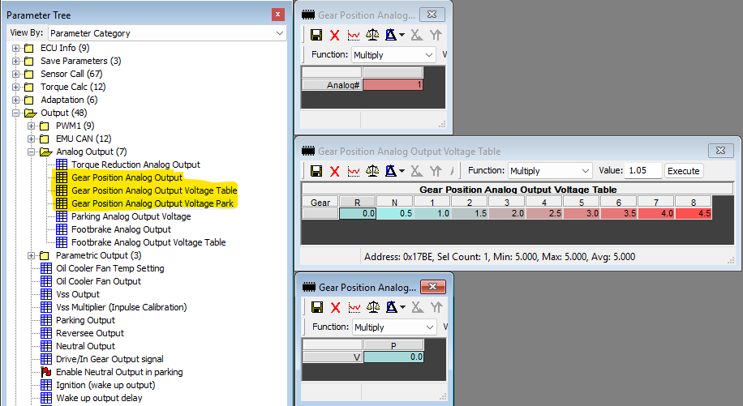

# Uno R4 Turbo Lamik Gear to GM Gen IV GMLAN
  Turbo Lamik Gear analog out to GMLAN Transmission General 2 CAN ID
  To allow E38 based GMT900 trucks to have reverse lights, backup camera
  auto switching and auto door unloock.

## Turbo Lamik Settings
* Configure the following settings in Tuner Pro and push them to your Turbo Lamik
  
* Terminate a wire to Pin 46 (analog out 1) in the Turbo Lamik connector. Please see https://manual.turbolamik.eu/docs/wiring/pinout/
* Terminate the other end of that wire to A0 on the Uno R4.
* Connect VIN on the Uno R4 to 12V+ switched ignition.
* Connect a GND Pin on the Uno R4 to chassis Ground.
