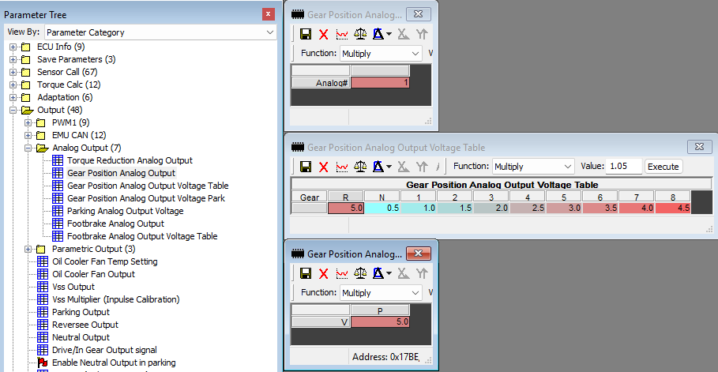

# Uno R4 Turbo Lamik Gear to GM Gen IV GMLAN
  Turbo Lamik Gear analog out to GMLAN Transmission General 2 CAN ID
  To allow E38 based GMT900 trucks to have reverse lights, backup camera
  auto switching and auto door unloock.

## Turbo Lamik Settings
* Configure the following settings in Tuner Pro and push them to your Turbo Lamik

